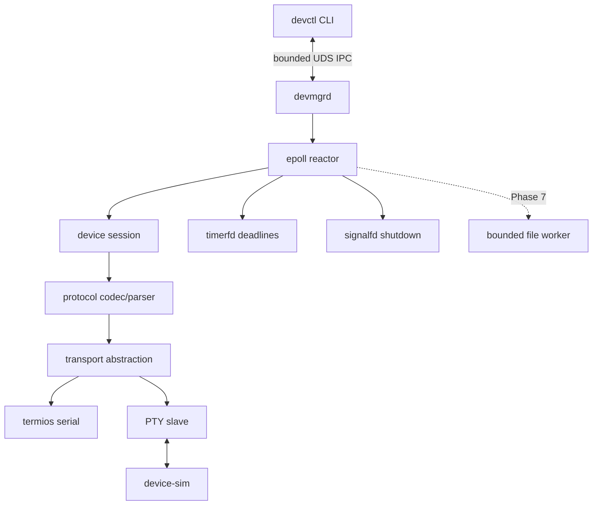

# Architecture

## Data Flow

`devctl` encodes one bounded IPC request. The daemon maps it to a device frame,
assigns a sequence, queues nonblocking transport output, and retains the client
association. Arbitrarily sliced input feeds the stream parser. A matching frame
completes the pending request and is encoded back to IPC. Device and IPC wire
formats are separate so local API evolution does not change firmware protocol.

Firmware upgrade is a daemon-owned asynchronous operation. The start request
returns an operation ID and closes its IPC connection. `devctl` presents a
synchronous user experience by polling that ID with short status exchanges;
closing the CLI does not cancel or orphan the device state machine. Device
request deadlines and FW_STATUS recovery therefore remain independent of any
single IPC socket lifetime.

## Event Loop and Thread Model

The daemon runs foreground and uses one epoll reactor. It owns the serial fd,
listener and client sockets, timerfd, signalfd, parser, request tracker, and all
mutable session state. Partial serial and socket output stays in reactor-owned
buffers. timerfd provides periodic monotonic deadline checks; signalfd makes
SIGINT/SIGTERM ordinary ordered events. No worker exists until firmware file
validation needs one in Phase 7.

## Resource Ownership

`daemon_context` exclusively owns every daemon descriptor and closes them in
reverse acquisition order. Each accepted client owns fixed input/output buffers
and serves one request before close. `devmgr_transport` owns only its fd; parser
and session own no heap memory. The simulator owns the PTY master while the
daemon independently owns the slave.

## Failure Propagation

Codec errors become stable `devmgr_status` values. Malformed clients receive an
error response and close. Sequence/duplicate errors are counted and ignored.
Bounded retry exhaustion is returned to the associated client. Transport loss
currently stops the daemon cleanly; reconnect and persistent upgrade recovery
are added in Phase 8. SIGTERM exits the loop, closes clients/transport/reactor
descriptors, and removes the socket path.
