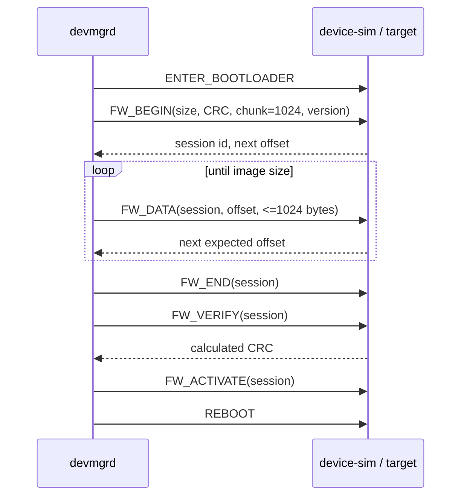

# Firmware Update

## Host Image Handling

`devctl upgrade FILE VERSION` resolves the path and sends it over owner-only UDS
IPC. The daemon opens with `O_NOFOLLOW|O_CLOEXEC`, requires a nonempty regular
file no larger than 16 MiB, maps it read-only/private, and computes CRC32. It
never allocates `file_size` bytes or sends the whole image in one frame. Mapping
and fd are released on success, protocol failure, timeout, signal shutdown, and
setup failure.

Starting an upgrade returns a daemon operation ID immediately. The CLI polls
state, result, acknowledged offset, and total size over separate bounded IPC
connections. There is no operation-wide IPC timeout: individual local exchanges
have a five-second liveness bound, while device requests retain their own
two-second deadline/retry policy and recovery cycles. If the CLI exits, the
daemon continues the operation and its status remains queryable by ID.

## Transfer Flow

The upgrade state machine is independent of device connection state. It owns
metadata and progress but borrows the read-only mapped image. Every response is
sequence-correlated by the session layer before it can advance upgrade state.
Offsets must equal the exact end of the last chunk and verification must return
the host CRC.

## Device Idempotency

The simulator accepts a new chunk only at `next_expected_offset`. A duplicate
whose byte range is already committed is ACKed with the current offset only when
its bytes match flash; it is not written twice. Gaps, overlaps, wrong session,
oversized chunks, incomplete END, and CRC mismatch receive NACK. This makes a
lost FW_DATA response safe to retry.

The simulator models flash in memory, which verifies protocol behavior rather
than real erase/program timing or power-loss atomicity. STM32 hardware still
requires physical validation.
