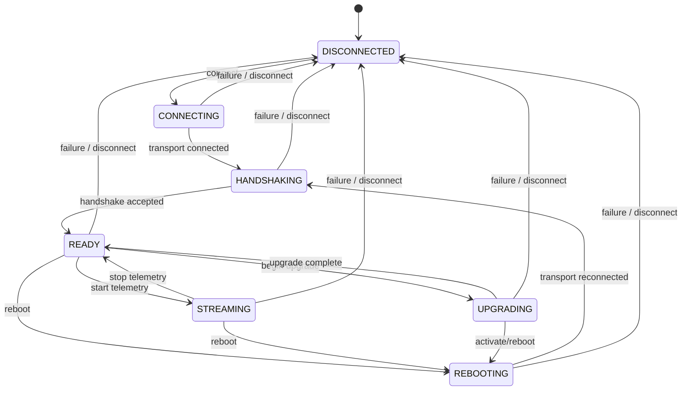
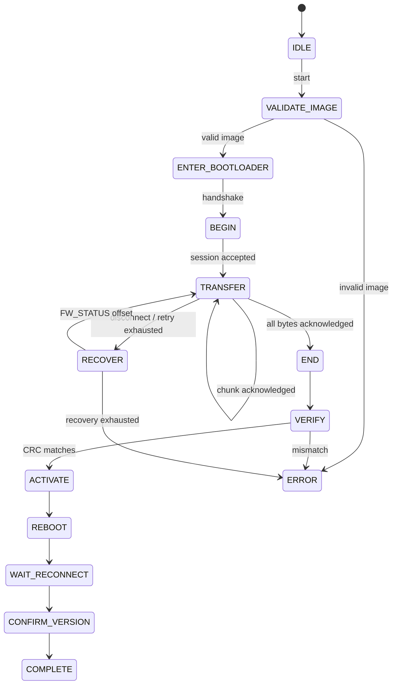

# State Machines

## Device Session

All changes pass through `devmgr_session_transition`; invalid edges return
`DEVMGR_ERROR_STATE`. A transport loss cancels any in-flight request. Upgrade
recovery later reconnects through the normal handshake and queries `FW_STATUS`.

## Request Lifecycle

Only one protocol request is in flight per serial device. The session assigns a
nonzero sequence, stores an owned copy, and records a monotonic deadline. A
matching response completes it. Wrong sequences and unexpected/duplicate
responses are counted but never complete another request. At deadline the exact
request is resent with the retry flag; after the bounded policy is exhausted it
returns timeout and clears pending state.

## Upgrade State Machine

The diagram is normative for Phase 7; its implementation remains separate from
device connectivity because upgrade progress survives a transport reconnect.

